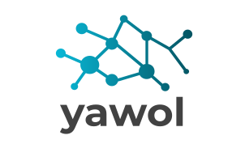
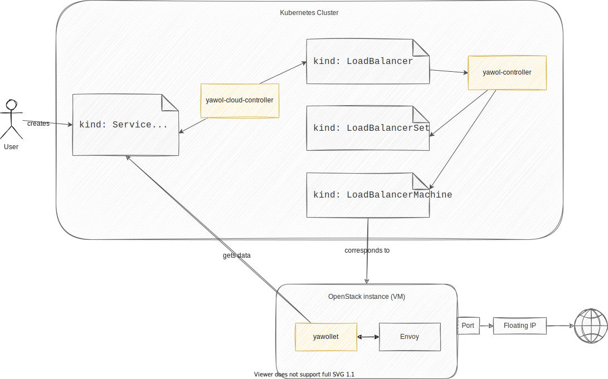

<p align="center">
  
</p>

<p align="center">
    <em>Do OpenStack Load Balancing the Kubernetes way.</em>
</p>

****

yawol (**y**et **a**nother **w**orking **O**penStack **L**oad Balancer) is a
Load Balancer solution for OpenStack, based on the Kubernetes controller
pattern.

****

## How It Works

yawol uses [kubebuilder](https://kubebuilder.io/) as the controller
framework and [gophercloud](https://github.com/gophercloud/gophercloud) for the
OpenStack integration. The actual load balancing is done by
[Envoy](https://www.envoyproxy.io/).

### Components

yawol has three main components: The `yawol-cloud-controller`, the
`yawol-controller`, and the `yawollet`.

#### The yawol-cloud-controller

The yawol-cloud-controller watches the Kubernetes cluster and translates
information back and forth between Kubernetes `Services`/`Nodes` and
`LoadBalancers`. `LoadBalancers` are one of the CRDs used by yawol. Whenever the
user creates a `Service` with `type: LoadBalancer`, the yawol-cloud-controller
creates a corresponding `LoadBalancer` resource.

Once the Load Balancer is ready (courtesy of yawol-controller, see below), the
yawol-cloud-controller reports the external IP back to the `Service`.
Additionally, the yawol-cloud-controller updates endpoint lists on the `Nodes`.

#### The yawol-controller

The yawol-controller creates the needed OpenStack resources for any
`LoadBalancer` object. It manages the following OpenStack resources:

* Floating IP
* Port
* SecurityGroup
* Instance (VM)

The instance is equipped with a `cloud-init` for the following settings:

* `kubeconfig` and settings for yawollet (see below)
* Debug settings

In order to manage these resources "the Kubernetes way", yawol adopts the
`Deployment` -> `ReplicaSet` -> `Pod` cascade and does the following:

`LoadBalancer` -> `LoadBalancerSet` -> `LoadBalancerMachine`

Where the `LoadBalancer` resource holds information on Floating IP, Port and
SecurityGroup; the `LoadBalancerSet` resource recreates `LoadBalancerMachines`
whenever they get unhealthy; and the `LoadBalancerMachine` itself represents the
OpenStack instance where the yawollet and Envoy do the actual Load Balancing.

#### yawollet

The yawollet is running on an OpenStack instance (like the `kubelet`) to
configure Envoy with information from the correspnding `LoadBalancer` object in
the Kubernetes cluster. To get this information, the yawollet uses a
`kubeconfig` that is provided by the yawol-controller via `cloud-init`.

### Overview



## How to Use It

### Installation

// TODO

### Run tests

```bash
make test
```
### Debugging yawollet

1. Upload ssh key-pair to OpenStack

   ```bash
   openstack keypair create <name> # create new keypair
   # or
   openstack keypair create --public-key <path> <name> # add existing pubkey
   ```

2. Add the following to `LoadBalancer`:

   ```yaml
   ...
   spec:
     debugSettings:
       enabled: true
       sshkeyName: <name>
   ...
   ```

3. SSH into the VM with username `alpine` and `externalIP` from `LoadBalancer`

### Dev-Setup (controllers running locally)

> In the following instruction the yawollet is running within an OpenStack VM
> that's booted from an OpenStack yawollet image.

If you want to run/test the yawollet locally see [local-yawollet](#local-yawollet)

#### Requirements

If you only want the `yawol-cloud-controller` (To test creation of
`LoadBalancer` from `Service`):

* Any kind of Kubernetes cluster (remote or local with `kind`)

If you want to develop end-to-end (`yawol-cloud-controller` and
`yawol-controller` locally, `yawollet` on VM):

* Access to a K8s cluster that is publicly reachable
* Access to OpenStack project via OpenStack API

#### Preparation

1. Generate and install yawol CRDs

   ```bash
   make install
   ```
2. Edit environment variables in `run-ycc.sh`

   These variables are required for yawol-cloud-controller and are later used by
   yawol-controller. For a local cluster the variables can be left as is, for a
   remote cluster set the variables to match the OpenStack resources:

   * `FLOATING_NET_ID`: ID of `floating-net`
   * `NETWORK_ID`: ID of the network
   * To use a different yawollet OpenStack image set `IMAGE_ID`. If testing in a
     different OpenStack project, make sure that the image can be accessed by
     the project. Set `visibility` to not be `private`, e.g.

     ```bash
     openstack image set --shared <ID>
     openstack image add project <image> <project>
     ```

3. Edit environment variables in `run-yc.sh`

   These variables are required for yawol-controller:
  
   * `API_ENDPOINT` = `https://` + IP/URL for Kubernetes API server (used by
     yawollet)

4. Create `cloud-provider-config` secret (required for yawol-controller and
   later used by yawollet)

   Use `example-setup/yawol-controller/provider-config.yaml` as template. The
   namespace needs to match `CLUSTER_NAMESPACE` in `run-ycc.sh` and `run-yc.sh`

#### Run

The controllers are using the default kubeconfig ($KUBECONFIG, InCluster or
\$HOME/.kube/config). To use a different kubeconfig see the instructions below. 

1. Run `yawol-cloud-controller`. To use a different kubeconfig set the
   `--control-kubeconfig` and`--target-kubeconfig` flags in `run-ycc.sh`.

   ```bash
   ./run-ycc.sh
   ```

2. Run `yawol-controller`. To use a different kubeconfig set the `--kubeconfig`
   flag in `./run-yc.sh`.

   ```bash
   ./run-yc.sh
   ```

#### Verify

**yawol-cloud-controller**

1. Create deployment and service:

   ```bash
   kubectl apply -f example-setup/yawol-cloud-controller
   # or
   kubectl create deployment --image nginx:latest nginx --replicas 1
   kubectl expose deployment --port 80 --type LoadBalancer nginx --name loadbalancer
   kubectl annotate service loadbalancer yawol.stackit.cloud/className=test # annotation needs to match the value of the `classname` flag from `run-ycc.sh`
   ```

2. Check if the yawol-cloud-controller created a new `LoadBalancer` object

**yawol-controller**

1. Reuse created `LoadBalancer` from yawol-cloud-controller **or** create a new
   one (use `example-setup/yawol-controller/loadbalancer.yaml` as template)

3. Check if the yawol-controller (loadbalancer-controller) created OpenStack resources (FloatingIP, Port, SecurityGroup) for the `LoadBalancer`
3. Check if the yawol-controller (loadbalancer-controller) created a `LoadbalancerSet` from the `LoadBalancer`
4. Check if the yawol-controller (loadbalancerset-controller) created a `LoadbalancerMachines` from the `LoadbalancerSet`
5. Check if the yawol-controller (loadbalancermachine-controller) created and configured an OpenStack VM for the `LoadbalancerMachine`
6. Once the VM (`LBM`) is ready check if the yawol-cloud-controller wrote the IP to the `Service`

### Local yawollet
#### Requirements

* Any kind of Kubernetes cluster (remote or local with `kind`)
* Envoy locally installed `make get-envoy` (downloaded from https://github.com/tetratelabs/archive-envoy/releases)

#### Preparation

1. Generate and install yawol CRDs:

   ```bash
   make install
   ```

2. Create `LoadBalancer` and `LoadBalancerMachine` object (use examples in
   `example-setup/yawollet/`):

   ```
   kubectl apply -f example-setup/yawollet/lb.yaml
   kubectl apply -f example-setup/yawollet/lbm.yaml
   ```

   This example adds an TCP LoadBalancer to forward port 8085 to localhost:9000
   which is the Envoy admin port.

#### Run

1. Start Envoy:

   ```bash
   envoy -c image/envoy-config.yaml
   ```

2. Run yawollet. To use a different kubeconfig set the `--kubeconfig` flag.

   ```bash
   go run ./cmd/yawollet/main.go --namespace=yawol-test \
      --loadbalancer-name=loadbalancer-sample \
      --loadbalancer-machine-name=loadbalancermachine-sample
   ```
#### Test

UDP testing with netcat:

1. `netcat -u -l -p 9001`
2. Open a new terminal
3. `netcat -u 127.0.0.1 8086`
4. Type something, hit enter and check if the message gets displayed in the first terminal

TCP testing using the admin port of Envoy:

1. Open http://localhost:8085 in your browser
2. You should get forwarded to the admin port of Envoy which is listening to localhost:9000
