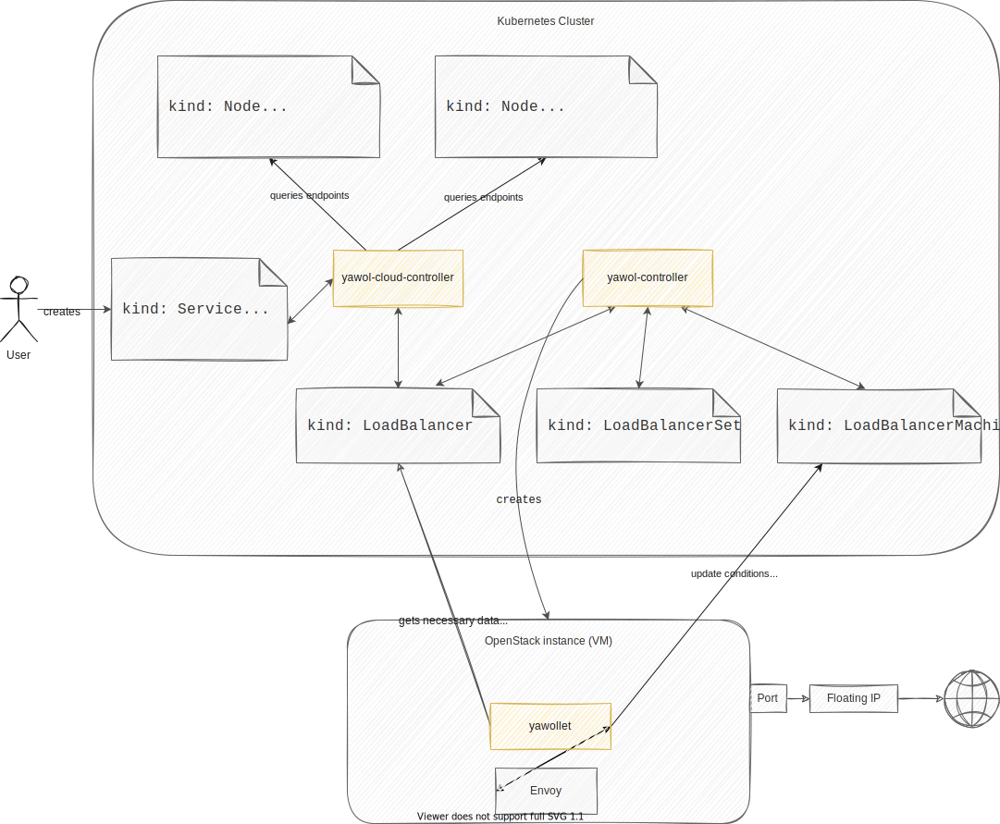

# Components Overview

yawol has three main components: The `yawol-cloud-controller`, the
`yawol-controller`, and the `yawollet`.

The figure below shows the interaction of these components on a high level. Read
on for a detailed description. 

## The yawol-cloud-controller

The yawol-cloud-controller watches the Kubernetes cluster and translates
information back and forth between Kubernetes `Services`/`Nodes` and
`LoadBalancers`. `LoadBalancers` are one of the CRDs used by yawol. Whenever the
user creates a `Service` with `type: LoadBalancer`, the yawol-cloud-controller
creates a corresponding `LoadBalancer` resource.

Once the Load Balancer is ready (courtesy of yawol-controller, see below), the
yawol-cloud-controller reports the external IP back to the `Service`.
Additionally, the yawol-cloud-controller updates endpoint lists on the `Nodes`.

### Controllers

#### **control-controller**

* Copies events from `LoadBalancer` to `Service`
* Writes external IP from `LoadBalancer` to `Service` once the LB is running and
  ready

#### **target-controller**

* `node-controller`
  * Watches K8s nodes and updates `LoadBalancer` endpoint list
* `service-controller`
  * creates a `LoadBalancer` from `Service` and enriches it with additional
	OpenStack data from environment variables

## The yawol-controller

The yawol-controller creates the needed OpenStack resources for any
`LoadBalancer` object. It manages the following OpenStack resources:

* Floating IP
* Port
* SecurityGroup
* Instance (VM)

The instance is equipped with a `cloud-init` for the following settings:

* `kubeconfig` and settings for yawollet (see below)
* Debug settings

In order to manage these resources "the Kubernetes way", yawol adopts the
`Deployment` -> `ReplicaSet` -> `Pod` cascade and does the following:

`LoadBalancer` -> `LoadBalancerSet` -> `LoadBalancerMachine`

Where the `LoadBalancer` resource holds information on Floating IP, Port and
SecurityGroup; the `LoadBalancerSet` resource recreates `LoadBalancerMachines`
whenever they get unhealthy; and the `LoadBalancerMachine` itself represents the
OpenStack instance where the yawollet and Envoy do the actual Load Balancing.

### Controllers

#### **loadbalancer-controller**

* Create/Reconcile/Delete following OpenStack resources for a `LoadBalancer`:
	* Floating IP
	* Port
	* SecurityGroup
* Creates/Recreate/Delete `LoadBalancerSet` if `LoadBalancer` is created/updated

#### **loadbalancerset-controller**

* Creates/Deletes `LoadBalancerMachines` from `LoadbalancerSet`
* Monitor `LoadBalancerMachine` status and recreates `LoadBalancerMachine` if node is unhealthy

#### **loadbalancermachine-controller**

* Create/Reconcile/Delete following OpenStack resources for a `LoadBalancerMachine`:
	* Instance (VM)
		* With cloud-init for the following settings
			* Kubeconfig for yawollet
			* Settings for yawollet
			* Debug settings
	* Connect instance to port
* Export metrics from `LoadBalancerMachine`

## yawollet

The yawollet is running on an OpenStack instance (like the `kubelet`) to
configure Envoy with information from the corresponding `LoadBalancer` object in
the Kubernetes cluster. To get this information, the yawollet uses a
`kubeconfig` that is provided by the yawol-controller via `cloud-init`.
